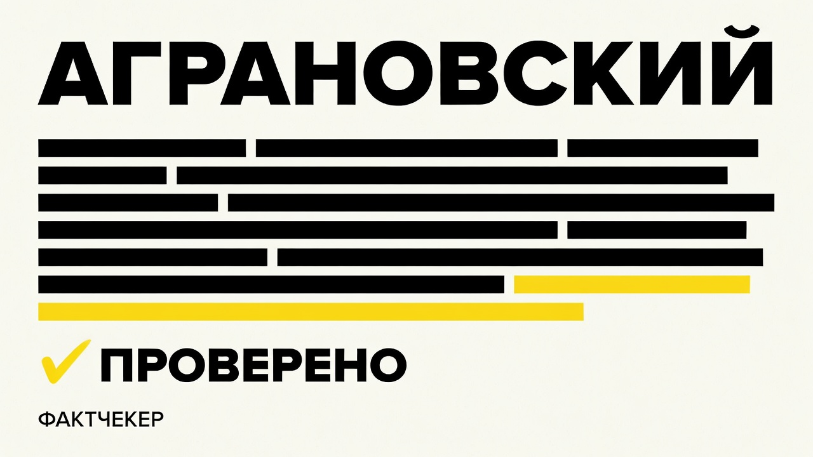

<p align="center">
  
</p>

# Аграновский

> **Claude Code-скил (команда `/аграновский`): фактчекер для текстов с LLM-галлюцинациями. Проверяет каждое фактическое утверждение против реальных источников: числа без ссылок, выдуманные цитаты, несуществующие законы, фейковые DOI. Принцип один — «нет пруфа — выдумано». Реальный веб-поиск, шкала из 7 вердиктов, строгий запрет на само-галлюцинирование пруфов.**

[](LICENSE)
[](https://docs.claude.com/en/docs/claude-code/overview)

---

## Зачем

LLM пишет убедительно. Иногда убедительно — и верно. Иногда убедительно — и выдумано.
Разница внешне незаметна: модель одинаково гладко сочиняет факты и повторяет настоящие.

Проблема не в орфографии и не в стиле — там ошибка видна. Фактические галлюцинации прячутся
в деталях: «37,4%» вместо реальных 12%, цитата, которую человек никогда не говорил, ФЗ с
правдоподобным номером, которого не существует, DOI в правильном формате — только ведёт
в никуда. Обычная вычитка их не ловит: корректор проверяет запятые, не базы данных.

Аграновский закрывает эту зону. Один вопрос к каждому проверяемому утверждению:
**«откуда ты это знаешь — покажи пруф».**

Имя — в честь Анатолия Аграновского, «журналиста № 1» советской печати. Его принципы:
глубина, проверка первоисточника, ответственность за каждое слово. Именно то, чего
нейросеть лишена по природе.

---

## Как работает

### Принцип «нет пруфа — выдумано»

Факт считается непроверенным по умолчанию. Уверенный + конкретный + без источника — это
красный флаг, а не свидетельство истины. Гладкость текста — не признак достоверности:
модель звучит одинаково, когда говорит правду и когда сочиняет.

### 5 шагов

**Шаг 1 — Экстракция.** Текст разбивается на атомарные утверждения: одно отношение между
сущностями на строку, самодостаточное. Местоимения («он», «тогда», «там») раскрываются —
чтобы каждый факт проверялся в отрыве от текста. Для каждого утверждения: тип риска (1–9)
и класс (факт / мнение / общеизвестное / гипотеза). Мнения и гипотезы откладываются — они
не проверяемы.

**Шаг 2 — Триаж.** Утверждения сортируются по убыванию риска галлюцинации (ссылки/DOI
наверху — их LLM выдумывает в 55–95% случаев). Доменные факты (медицина, право, финансы,
налоги) получают флаг «нужен эксперт»: цена ошибки там необратима.

**Шаг 3 — Верификация (CoVe + реальный поиск).** По каждому утверждению:
- формулируется нейтральный проверочный вопрос (без подсказки из текста, иначе модель
  просто согласится с тем, что видит);
- запускается реальный WebSearch/WebFetch — не «вспоминание», а открытие страницы;
- для спорных и критичных фактов — два независимых источника (два пересказа одного
  пресс-релиза не считаются);
- применяется lateral reading: оценивается не то, что источник говорит о себе, а что о нём
  пишут другие.

**Шаг 4 — Вердикт.** Каждому факту назначается знак по шкале (см. ниже). ✅ «Подтверждён»
ставится ТОЛЬКО если в этой сессии реально открыт источник через tool-call и из него приведена
дословная цитата. Не нашёл пруф — пишем ❓ «Не подтверждён», не выдумываем.

**Шаг 5 — Отчёт.** Таблица флагов + сводка красных флагов + блок «что выдумано».
В режиме Правка — применяются правки к тексту.

### Анти-самогаллюцинация

Главная ловушка авто-фактчекинга: проверяльщик сам начинает галлюцинировать пруфы.
Аграновский работает под строгими правилами:

- Запрещено выдумывать URL, DOI, цитаты «из памяти» — только то, что реально открыто.
- ✅ и ❌ ставятся только при наличии tool-call в логе + дословной цитаты из открытой страницы.
- Если только сниппет поисковой выдачи без открытия страницы — максимум ⚠️ или ❓, с пометкой
  «(по выдаче, страница не открыта)».
- Поиск недоступен или пуст → «не проверено». Никогда не закрывать пробел догадкой.
- «Я проверил» от модели — не проверка. Проверка — это лог инструментов.

---

## Шкала вердиктов

| Знак | Вердикт | Когда |
|---|---|---|
| ✅ | **Подтверждён** | реальный источник открыт, дословная цитата совпадает |
| ⚠️ | **Уточнить** | в основе верно, но есть неточная второстепенная деталь |
| 🟡 | **Смешанный** | часть верна, часть нет; или верно, но вырвано из контекста и вводит в заблуждение |
| ❓ | **Не подтверждён** | пруфа не найдено — НЕ доказано, что ложь |
| ❌ | **Ошибочный** | найден контр-пруф: источник прямо опровергает |
| 🕒 | **Устарел** | был верен, сейчас нет |
| 👤 | **Нужен эксперт** | медицина / право / финансы / налоги — LLM-проверки недостаточно |

Ценен не ярлык, а **след к нему**: у каждого вердикта, кроме ❓, — источник и цитата.

---

## Что НЕ делает

- **Не правит стиль, голос, структуру** — это работа других скилов семьи (смысловой редактор,
  корректор, детектор нейрослопа, типограф).
- **Не флагует мнения, гипотезы, прогнозы, личный опыт, риторику** — только проверяемые факты.
  Ложные срабатывания на суждениях убивают доверие к отчёту так же, как пропущенная ложь.
- **Не флагует общеизвестное** («Волга впадает в Каспийское море») из-за педантичных споров
  специалистов — это шум, не фактчекинг.
- **Медицина / право / финансы / налоги → нужен эксперт.** LLM-фактчекинг доменных утверждений
  недостаточен: цена ошибки необратима. Аграновский ставит 👤 и передаёт слово специалисту.

---

## Установка

Скил — два файла в папке `.claude/`. Скопируйте их в свой проект **или** в глобальную
папку Claude Code (`~/.claude/`), чтобы скил был доступен везде.

**В конкретный проект:**
```bash
git clone https://github.com/beaverbeard/agranovsky.git
cp -r agranovsky/.claude/skills/agranovsky .claude/skills/
cp    agranovsky/.claude/commands/agranovsky.md .claude/commands/
```

**Глобально (во все проекты):**
```bash
cp -r agranovsky/.claude/skills/agranovsky ~/.claude/skills/
cp    agranovsky/.claude/commands/agranovsky.md ~/.claude/commands/
```

Перезапустите Claude Code — скил «Аграновский» и команда `/аграновский` появятся в списке.

---

## Примеры

**Запрос:** «/аграновский» + текст о рынке онлайн-образования с цифрами.

```
# Аграновский — фактчек

Режим: Разбор · Объём: полный
Утверждений проверено: 8 · ✅ 2 · ⚠️ 1 · ❓ 3 · ❌ 1 · 👤 1

## Флаги (по серьёзности)
| Утверждение | Тип | Вердикт | Источник + цитата | Что делать |
|---|---|---|---|---|
| «рынок вырос на 37,4% в 2023» | 3 | ❌ | hse.ru: «рост 12,1% в 2023» | заменить на 12,1% |
| «как сказал Иванов на форуме: …» | 2 | ❓ | пруфа не найдено | убрать или смягчить |
| «согласно ФЗ-478 от 2021» | 6 | ❓ | закон не обнаружен | убрать ссылку |

## Признание: что выдумано / без пруфа
- Цифра 37,4% — реальные данные HSE показывают 12,1%
- Цитата Иванова — поиск по стенограммам форума результата не дал
- ФЗ-478 от 2021 — в pravo.gov.ru не найден

## Нужен эксперт (👤)
- Утверждение о налоговом вычете за онлайн-курсы — нужна актуальная норма НК РФ
```

---

## FAQ

**Зачем это, если есть обычная проверка фактов?**
Обычная корректура не ищет первоисточники и не запускает поиск — она работает по знанию
корректора. Аграновский запускает реальные веб-запросы по каждому утверждению и требует
дословной цитаты из открытой страницы. Ни один вычитчик не держит в голове Росстат, PubMed
и pravo.gov.ru одновременно.

**Аграновский проверяет весь текст или только подозрительное?**
В полном режиме (default) — все проверяемые утверждения. В быстром — только самое опасное:
ссылки/DOI, цитаты, числа, имена/сущности (типы 1–4). В точечном — один конкретный фрагмент.

**Чем ❓ «Не подтверждён» отличается от ❌ «Ошибочный»?**
Принципиально. ❓ значит: поиск был, пруфа нет — факт неподтверждён, но не доказана ложь.
❌ значит: найден контр-пруф, который прямо опровергает утверждение. Не смешивать.

**Что делать с результатом режима Правка?**
Скил консервативно смягчает или вырезает недоказанное — не выдумывает «как правильно».
Заменить выдуманную цифру на верную он может только с найденным пруфом. Без пруфа —
убирает конкретику или ставит пометку [пруф?].

**Это дорого по токенам?**
Да. Полный прогон лонгрида — десятки поисков. Аграновский — тяжёлый инструмент для
финальной проверки перед публикацией, не для каждого черновика. Для быстрого прохода —
режим «быстрый» (только типы 1–4).

---

## Скилы для рИИдакторов

«Аграновский» — скил для редакторов из семьи **[рИИдактор](https://redaktozavr.ru/rAIdactor?utm_source=skills)**, рассылки
про работу редактора с ИИ. Каждый скил семьи закрывает свою зону, не пересекаясь:

| Скил | Зона | Природа |
|------|------|---------|
| [Виноградов](https://github.com/beaverbeard/vinogradov) | Сборка авторского голоса (Voice DNA) из корпуса | Скрипт + LLM |
| [Бахтин](https://github.com/beaverbeard/bakhtin) | Генерация черновика: multi-agent, 7 форматов | LLM |
| [Чуковский](https://github.com/beaverbeard/chukovsky) | Смысл, структура, голос, канцелярит | LLM |
| **Аграновский** | **Верификация фактов и галлюцинаций** | **LLM + поиск** |
| [Слопотрон](https://github.com/beaverbeard/slopotron) | AI-маркеры и нейрослоп | LLM |
| [Розенталь](https://github.com/beaverbeard/rozental) | Орфография, пунктуация, согласование, единообразие | LLM |
| [Мильчин](https://github.com/beaverbeard/milchin) | Типографика и юникод-гигиена | Скрипт |

Канонический порядок при полной вычитке:
**Чуковский → Аграновский → Слопотрон → Розенталь → Мильчин** (смысл → истина → детектор → буква → форма).

Рядом с конвейером вычитки — **[Виноградов](https://github.com/beaverbeard/vinogradov)**: он не правит текст, а собирает авторский голос (Voice DNA) из реального корпуса — тот самый, которым потом пишут и под который вычитывают остальные.

Аграновский идёт **вторым** в конвейере, сразу за Чуковским, и по канону **обязателен**.
Чуковский помечает подозрительные факты флагом — Аграновский их верифицирует по
первоисточникам. Пропускают только явной командой «без фактчека», когда в тексте
заведомо нет проверяемой фактуры. Да, инструмент дорогой (десятки поисков на лонгрид) —
но это часть полной вычитки, а не доплата по запросу.

---

## Лицензия

[MIT](LICENSE) — берите, форкайте, ломайте, чините.

Имя «Аграновский» используется как почтительная аллюзия на классика журналистики, без
претензии на ассоциацию с его наследниками или правообладателями.
